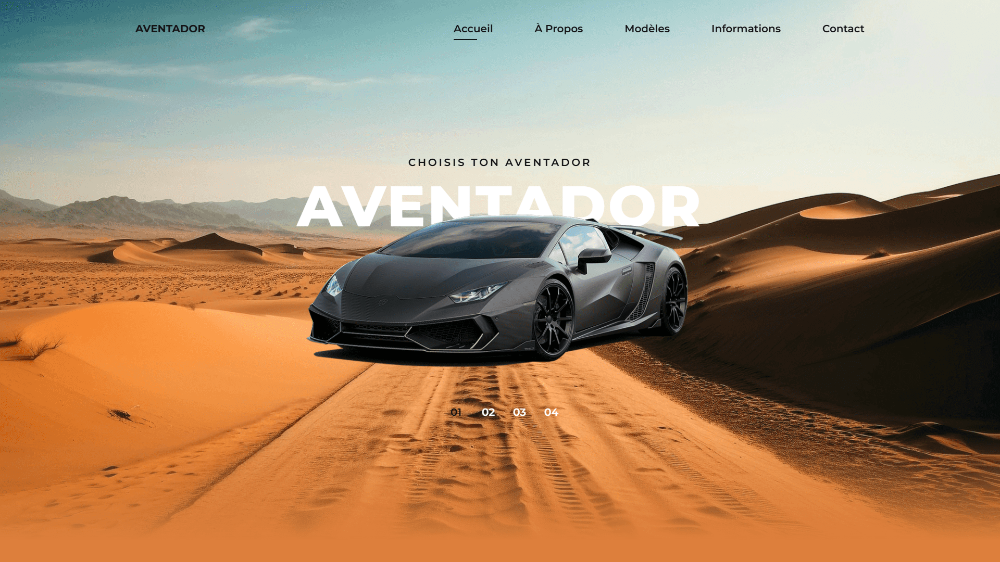

<div align="center">  
    <a href="https://gasoline-car-store-vm.netlify.app/" target="_blank">  
        
    </a>
    </br>  
    </br>  
  <h3 align="center">🚀 Aventador &nbsp; — &nbsp; Lamborghini LP 780-4 Ultimae</h3>  
</div>

## <br /> 📌 Sommaire

&nbsp;&nbsp;&nbsp; 🎨 &nbsp; [**Introduction**](#introduction)<br />
&nbsp;&nbsp;&nbsp; 🛠️ &nbsp; [**Technologies**](#technologies)<br />
&nbsp;&nbsp;&nbsp; 🎯 &nbsp; [**Fonctionnalités**](#fonctionnalités)<br />
&nbsp;&nbsp;&nbsp; 🚀 &nbsp; [**Installation**](#installation)<br />

## <br /> <a name="introduction">🎨 Introduction</a>

Aventador est une landing page premium dédiée à la Lamborghini LP 780-4 Ultimae. Design immersif, animations saisissantes et navigation fluide. Tout est pensé pour offrir une expérience visuelle unique et mettre en valeur la puissance du modèle.

## <br /> <a name="technologies">🛠️ Technologies</a>

- HTML5 sémantique et structuration claire
- CSS3 moderne avec variables, media queries et animations
- JavaScript ES6 clair et modulaire
- [Swiper.js](https://swiperjs.com/) pour le carrousel de modèles
- [ScrollReveal](https://scrollrevealjs.org/) pour des animations au scroll
- [Remix Icons](https://remixicon.com/) pour des icônes vectorielles modernes
- Responsive Design pensé en mobile-first

## <br /> <a name="fonctionnalités">🎯 Fonctionnalités</a>

- Hero animé avec carrousel Swiper des différents coloris
- Vidéo immersive intégrée dans la section à propos
- Présentation des modèles par teinte
- Détails techniques dynamiques
- Formulaire de contact stylisé et responsive
- Menu mobile animé avec ouverture et fermeture fluide
- ScrollUp dynamique et lien actif synchronisé avec le scroll
- Animations ScrollReveal sur chaque section clé
- Design entièrement responsive, pensé mobile-first
- Structure propre, modulaire et maintenable

## <br /> <a name="installation">🚀 Installation</a>

### ✅ Prérequis

- [Google Chrome](https://www.google.com/) &nbsp;—&nbsp; Navigateur moderne
- [Visual Studio Code](https://code.visualstudio.com/) &nbsp;—&nbsp; Éditeur de code
- [Live Server](https://marketplace.visualstudio.com/items?itemName=ritwickdey.LiveServer) &nbsp;—&nbsp; Extension VS Code

### 📥 Cloner le projet

```bash
git clone git@github.com:ValentinMadiot/gasoline-car-store_ui
cd gasoline-car-store_ui
```

### ▶️ Lancer le projet

Il suffit d’ouvrir le fichier `index.html` dans un navigateur, ou d’utiliser l’extension **Live Server** sur VS Code pour un aperçu dynamique.
